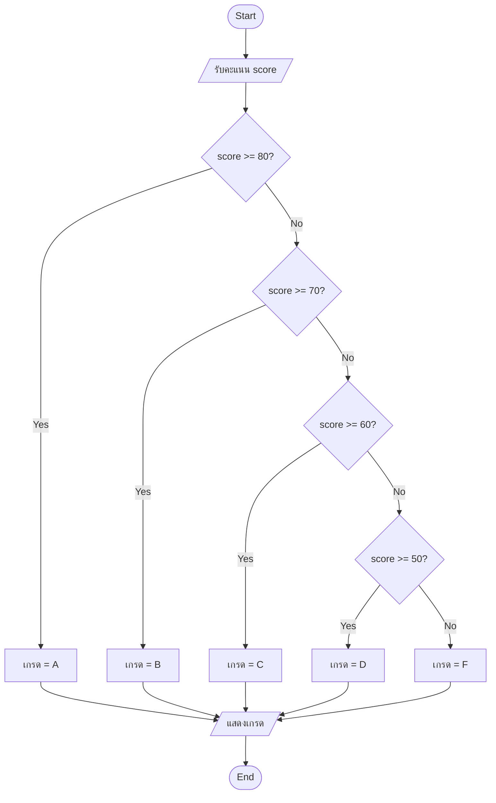
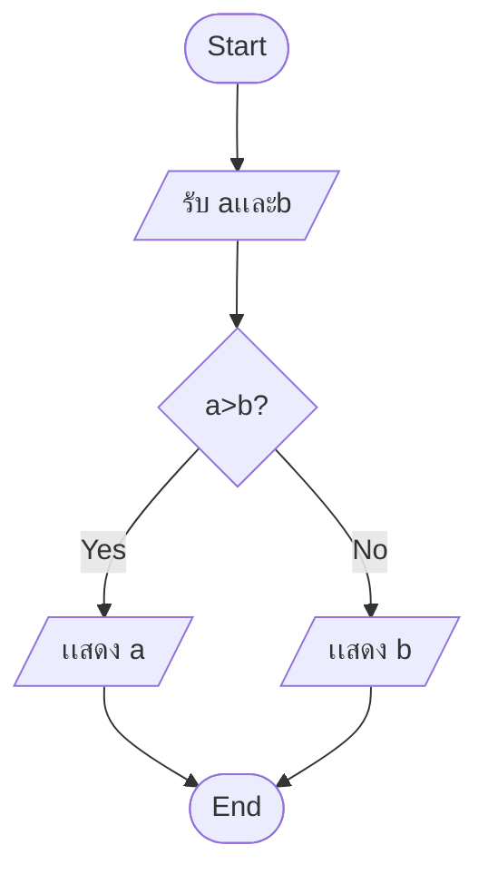
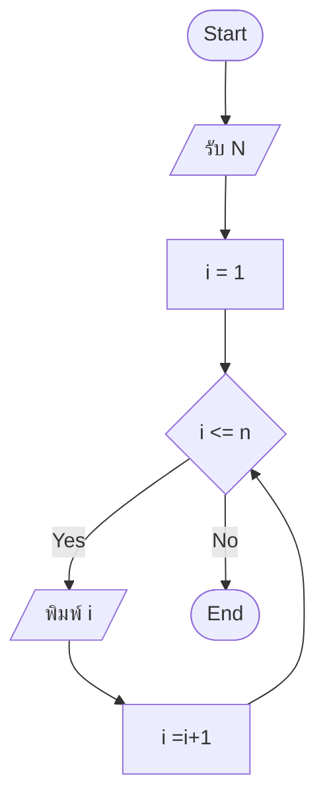

```mermaid
flowchart TD
 Start([Start]) --> Input[/รับคะแนน score/]
 Input --> D1{score >= 80?}
 D1 -->|Yes| A[เกรด = A]
 D1 -->|No| D2{score >= 70?}
 D2 -->|Yes| B[เกรด = B]
 D2 -->|No| D3{score >= 60?}
 D3 -->|Yes| C[เกรด = C]
 D3 -->|No| D4{score >= 50?}
 D4 -->|Yes| D[เกรด = D]
 D4 -->|No| F[เกรด = F]
 A & B & C & D & F --> Output[/แสดงเกรด/]
 Output --> End([End])
```

```mermaid
flowchart TD
 Start([Start]) --> Input[/รับ aเเละb /]
 Input --> A{a>b?}
 A --> |Yes| a[/เเสดง a/]
 A --> |No| b[/เเสดง b/]
 a & b --> End([End])
  
 
```

```mermaid
flowchart TD
 Start([Start]) --> Input[/รับ N /]
 Input --> A[i = 1]
 A --> B{i <= n}
 B --> |Yes| a[/พิมพ์ i/]
 a --> c[i =i+1]
 c --> B
 B --> |No| b([End])


```

