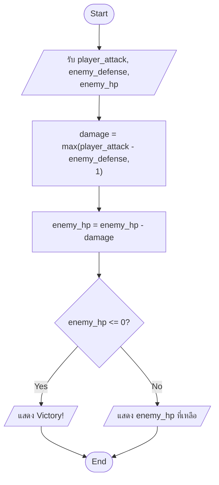
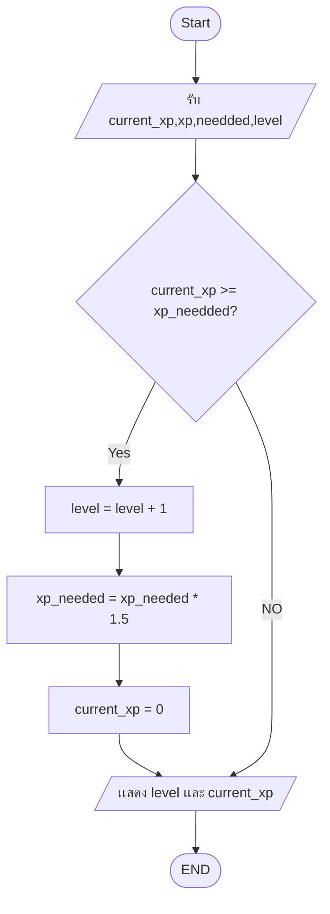

```mermaid
flowchart TD
 Start([Start]) --> Input[/รับ player_attack, enemy_defense,
enemy_hp/]
 Input --> Calc["damage = max(player_attack - enemy_defense,
1)"]
 Calc --> Reduce["enemy_hp = enemy_hp - damage"]
 Reduce --> D1{enemy_hp <= 0?}
 D1 -->|Yes| Win[/แสดง Victory!/]
 D1 -->|No| Show[/แสดง enemy_hp ที่เหลือ/]
 Win & Show --> End([End])

```


```mermaid
flowchart TD
 Start([Start]) --> Input[/รับ current_xp,xp,needded,level /]
 Input --> A{current_xp >= xp_needded?}
 A --> |Yes| a[level = level + 1]
 a -->  b[xp_needed = xp_needed * 1.5]
 b -->  c[current_xp = 0]
 c --> d[/เเสดง level เเละ current_xp /]
 d --> f([END])
 A --> |NO| d


 
 
```


```

```


```

```
